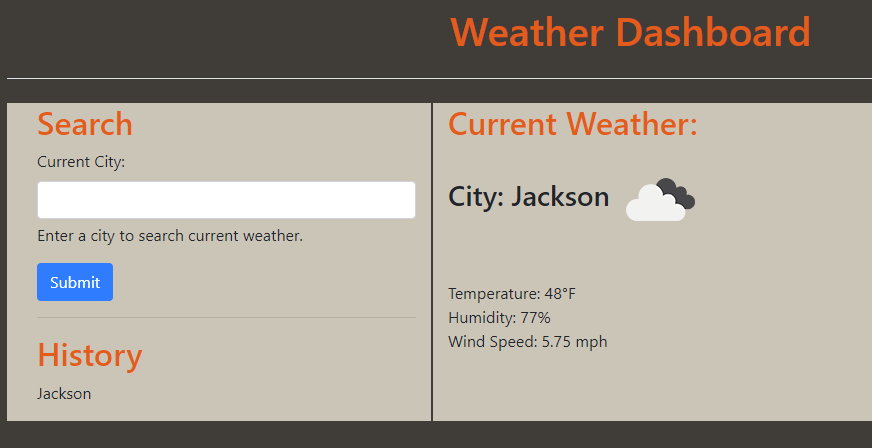

# Weather-Dashboard
This repository holds the code for my weather dashboard application. 

## Description
This application is a dashboard that displays weather for the searched city.

## Usage

Enter the city you wish to see weather for in the text field and click submit. 

The Weather Dashboard can be accessed via GitHub Pages [HERE](https://hdavis147.github.io/Weather-Dashboard/).

## Credits

All code written by me. 

## License

[MIT License](./LICENSE)
